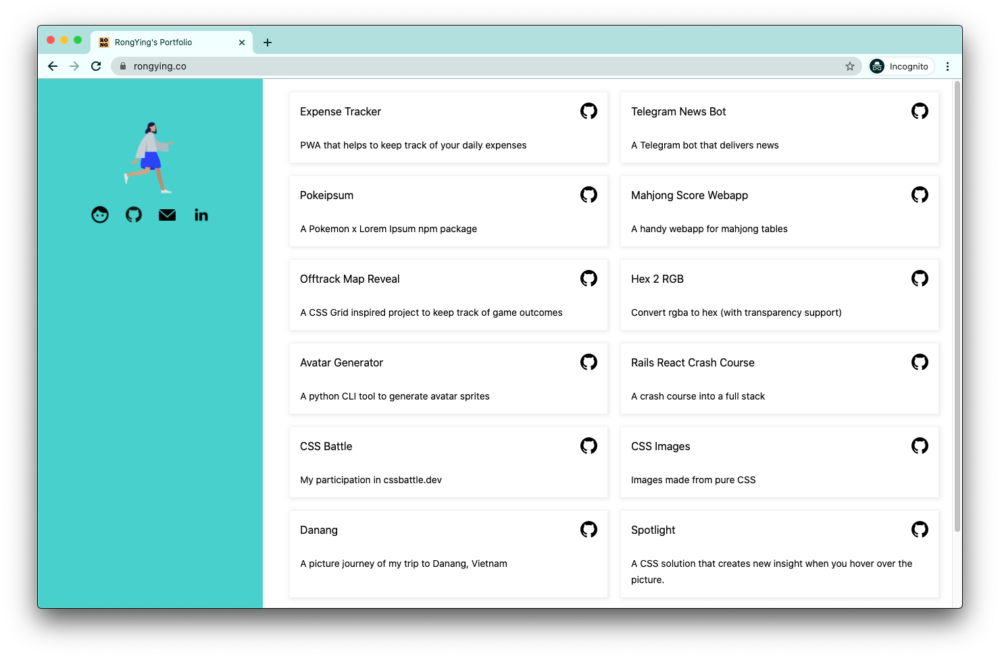
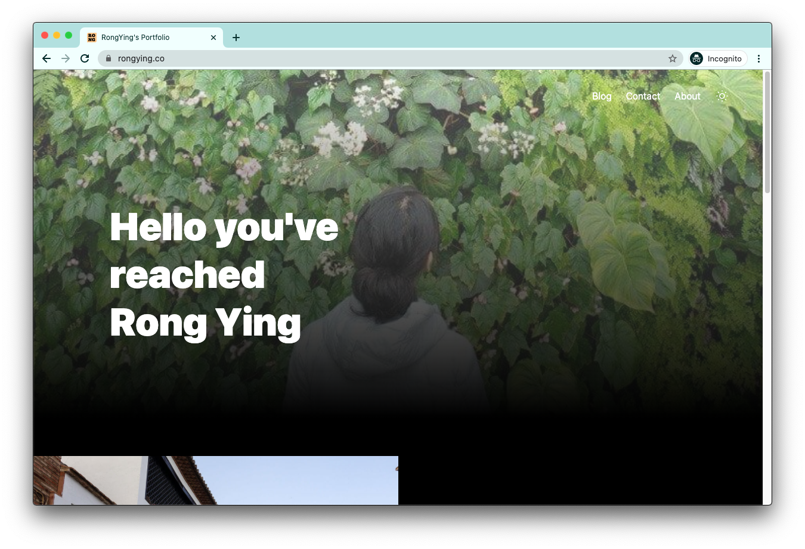

# Portfolio
---

Built with [Svelte](https://svelte.dev), Snowpack and TailwindCSS

## Get started

Install the dependencies...

```bash
npm install

npm start

npm test

npm run build
```

## Deploying
Deployed on Netlify


## Notes



Updated old website
- Added Snowpack, Tailwind CSS. 
- Added dark mode toggle